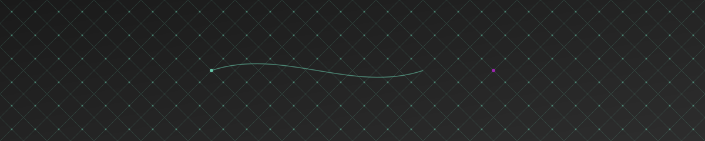

# Hi there, I'm Gilbert Cheruiyot 👋

  <!-- AI-Themed Header -->
  

  <!-- Animated Typing Header -->
  
  
  <!-- Enhanced Focus Badges -->
  

    
    
    
  

  <!-- Refined Mission Statement -->
  <blockquote>
    

      "Bridging the gap between complex AI systems and practical solutions through <strong>innovative architectures</strong> and <strong>accessible tools</strong>. 
      Committed to making AI technology <em>understandable</em>, <em>practical</em>, and <em>accessible to all developers</em>."
    

  </blockquote>

  <!-- Tech Stack Carousel -->
  

    
    
    
    
  

  <!-- Visitor Counter -->
  

    
  

<!-- Wave Divider -->

  

## About Me 🚀

I'm a Software Engineer and AI Solutions Architect focused on making artificial intelligence practical and accessible. I specialize in:

- 🤖 **AI & Automation**: Building practical AI solutions that solve real business problems and enhance individual productivity
- 🛠️ **AI-Enhanced Development**: Leveraging tools like Cursor AI and Lovable.dev to revolutionize how we build software
- ☁️ **AI-Powered DevOps**: Implementing intelligent automation in cloud infrastructure and deployment pipelines
- ✍️ **Technical Writing**: Sharing insights on practical AI applications on [Hashnode](https://hashnode.com/@gilbertofke) and [Medium](https://medium.com/@gilbertofke)

## Tech Stack & Tools 🛠️

  <!-- AI & ML -->
  <h3>🧠 AI & Machine Learning</h3>
  

    
    
    
    
    
    
    
  

  <!-- No-Code & Automation -->
  <h3>🔧 No-Code & Automation</h3>
  

    
    
    
    
    
  

  <!-- Web Scraping & Automation -->
  <h3>🕷️ Web Scraping & Automation</h3>
  

    
    
    
    
    
  

  <!-- Cloud & DevOps -->
  <h3>☁️ Cloud & DevOps</h3>
  

    
    
    
    
  

  <!-- Development -->
  <h3>💻 Development</h3>
  

    
    
    
    
  

## Current Focus 🎯

  <table>
    <tr>
      <td>AI-Powered Development with Cursor & Lovable.dev</td>
      <td>
        
      </td>
    </tr>
    <tr>
      <td>Practical AI Solutions for Business</td>
      <td>
        
      </td>
    </tr>
    <tr>
      <td>AI-Enhanced Cloud Architecture</td>
      <td>
        
      </td>
    </tr>
  </table>

## Weekly Development Metrics 📊
<!-- This section is automatically updated by GitHub Actions -->

## Technology Leaderboard 🏆

  <!-- Language Stats -->
  <h3>💻 Most Used Languages</h3>
  
  
  <!-- Technology Usage -->
  <h3>🔥 Technology Proficiency</h3>
  <table style="background-color: transparent;">
    <tr>
      <td><b>AI/ML Development</b></td>
      <td>
        
      </td>
    </tr>
    <tr>
      <td><b>Cloud Architecture</b></td>
      <td>
        
      </td>
    </tr>
    <tr>
      <td><b>Backend Development</b></td>
      <td>
        
      </td>
    </tr>
    <tr>
      <td><b>Frontend Development</b></td>
      <td>
        
      </td>
    </tr>
  </table>

  <!-- GitHub Stats -->
  <h3>📈 Contribution Stats</h3>
  

## Featured Projects 🌟

  
  

## Let's Connect 🤝

  
  
  
  

## Support My Work ☕

  

  
Your support helps me create more AI tools and educational content!

<!--START_SECTION:buy-me-a-coffee-->
<!--END_SECTION:buy-me-a-coffee-->

---

  
🤝 Open for collaborations in AI, Cloud Architecture, and DevOps Automation

  
📫 Reach me at: <strong>gilbertofke@gmail.com</strong>

