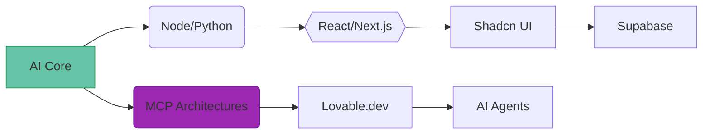

<!-- Animated Neural Network Header -->

  <picture>
    <source media="(prefers-color-scheme: dark)" srcset="https://raw.githubusercontent.com/gilbertofke/gilbertofke/output/github-contribution-grid-snake-dark.svg">
    <source media="(prefers-color-scheme: light)" srcset="https://raw.githubusercontent.com/gilbertofke/gilbertofke/output/github-contribution-grid-snake.svg">
    
  </picture>

<h1 align="center">
  
</h1>

  <h3 style="color: #9C27B0">Building Cognitive Automation Systems | MCP Innovator | AI-First Engineer</h3>
  
  <!-- Tech Focus Badges -->
  

    
    
    
    
  

  
🤖 <strong>Building the future of AI-powered development and automation</strong> 🚀

  

    
    
  

---

<h1 align="center" style="color: #66C4A7;">Hi 👋, I'm Gilbert Cheruiyot</h1>
<h3 align="center" style="color: #E1E6F0;">Software Engineer | Cloud & DevOps Engineer | Technical Writer</h3>

  

  

  

- 🔭 I'm currently working on **DevOps/Cloud Projects**, **Frontend Development** with **React/Next.js/Typescript**, and **AWS**-related implementations.
- 🌱 I'm currently learning **Kubernetes** and **ArgoCD** for CI/CD pipelines.
- 👯 I'm looking to collaborate on **DevOps/Cloud**, **Python Projects**, **React/Next.js**, **Typescript**, **Jenkins**, and **Ansible**.
- 📝 I regularly write articles on [Hashnode](https://hashnode.com/@gilbertofke) and [Medium](https://medium.com/@gilbertofke).
- 💬 Ask me about **DevOps**, **SRE**, **AWS**, **Software Dev**, and **Cloud Automation**.
- 📫 How to reach me: **gilbertofke@gmail.com**

### Blogs posts
<!-- BLOG-POST-LIST:START -->
<!-- BLOG-POST-LIST:END -->

<h3 align="left" style="color: #F1F5F8;">Connect with me:</h3>

  
  
  
  
  

<h3 align="left" style="color: #F1F5F8;">Languages and Tools:</h3>

 
   
  
  
  
  
  
  
  
  
  

## 🧠 AI & Tech Stack

  <!-- AI Engines -->
  <a href="#" style="text-decoration: none;">
    
     
    
    
    
    
  </a>

  <!-- Core Stack -->
  <a href="#" style="text-decoration: none;">
    
     
    
    
    
    
  </a>

  <!-- Infrastructure -->
  <a href="#" style="text-decoration: none;">
    
     
    
    
    
    
  </a>

  <!-- Dev Tools -->
  <a href="#" style="text-decoration: none;">
    
     
    
    
    
  </a>

## 📈 Active Learning

  <table>
    <tr>
      <td>MCP Server Patterns</td>
      <td>
        
      </td>
    </tr>
    <tr>
      <td>Vibe-Coding Principles</td>
      <td>
        
      </td>
    </tr>
    <tr>
      <td>AI-Enhanced CI/CD</td>
      <td>
        
      </td>
    </tr>
  </table>

## 🚀 AI Project Showcase

## 🤝 Collaboration Matrix

| AI Focus Area | Tools | Collaboration Format |
|--------------|-------|---------------------|
| MCP Development | Lovable.dev, Cursor AI | Open Source Contributions |
| AI Automation Agents | LangChain, CrewAI | Joint Prototyping |
| Cognitive CI/CD | GitHub Actions, Argo AI | Research Partnerships |

## 🎯 AI Engineering Philosophy

> "Building intelligent systems that augment human creativity and productivity through cognitive automation."

  
  
  

### 🔄 Weekly AI Development Metrics
<!-- This section is automatically updated by GitHub Actions -->

  <h3>🤖 Let's Build Something Intelligent Together 🚀</h3>
  
Open for AI collaborations and innovative projects

  

